# UI Screenshots

Screenshots of the Racing Manager UI, ordered along a full event lifecycle.
File names are prefixed with a number group: `00x` spectator view, `01x` event
setup, `02x` qualification, `03x`/`04x` race control, `05x` results, `9xx`
operations.

## Spectator View

The public, fullscreen-capable display (opened via *Open Spectator View*).
Leaderboard left, current head-to-head heat centre, upcoming races right.

### 000 — Qualification, heat armed

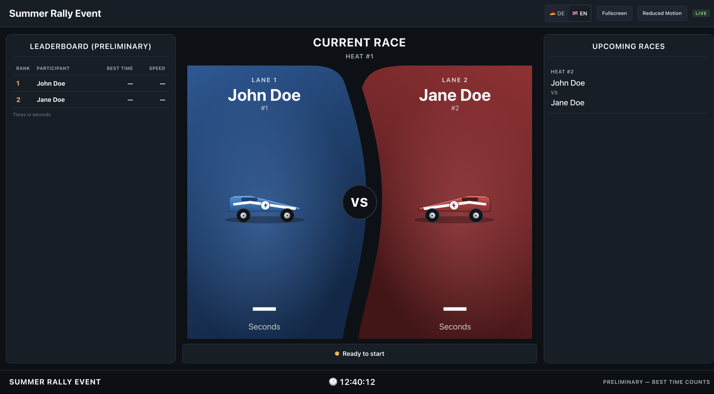

Heat #1 ready to start; the preliminary leaderboard still has no times.

### 001 — Qualification running

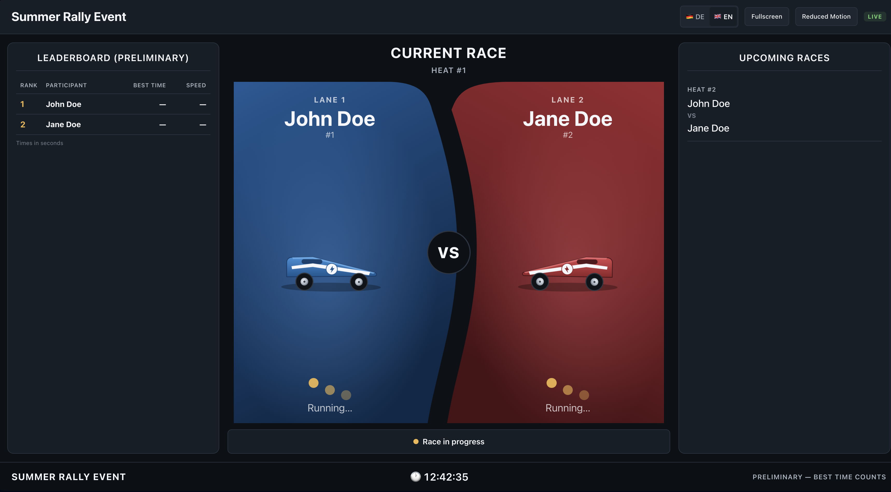

Both lanes show "Running…", the status bar reads *Race in progress*.

### 002 — Qualification finished

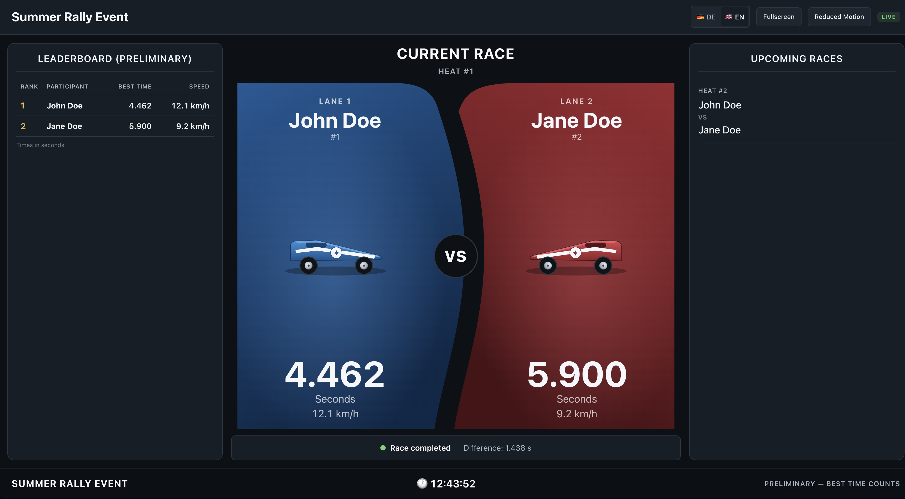

Final time and km/h per lane, gap to the winner, leaderboard updated.

### 003 — Knockout, heat armed

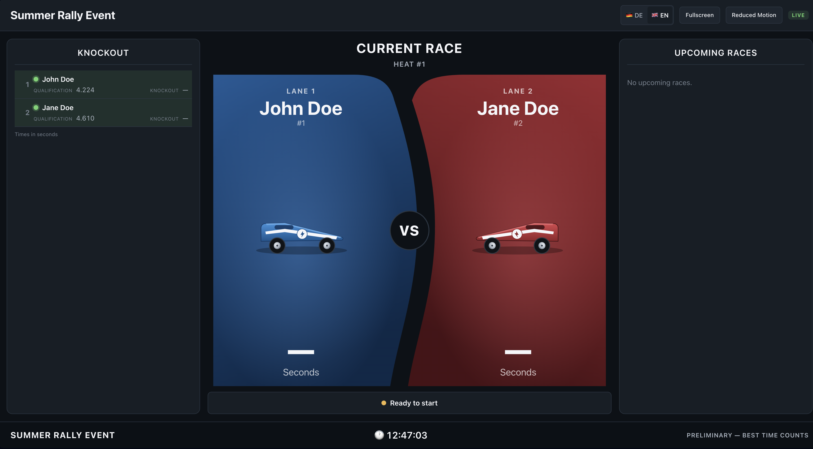

The left panel switches to the knockout bracket carrying the qualification times.

### 004 — Knockout winner

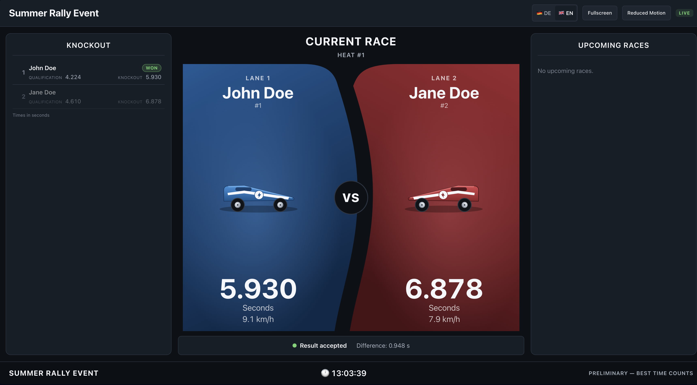

Result accepted, the winner is marked *WON* in the bracket.

## Event Setup

### 010 — Create event

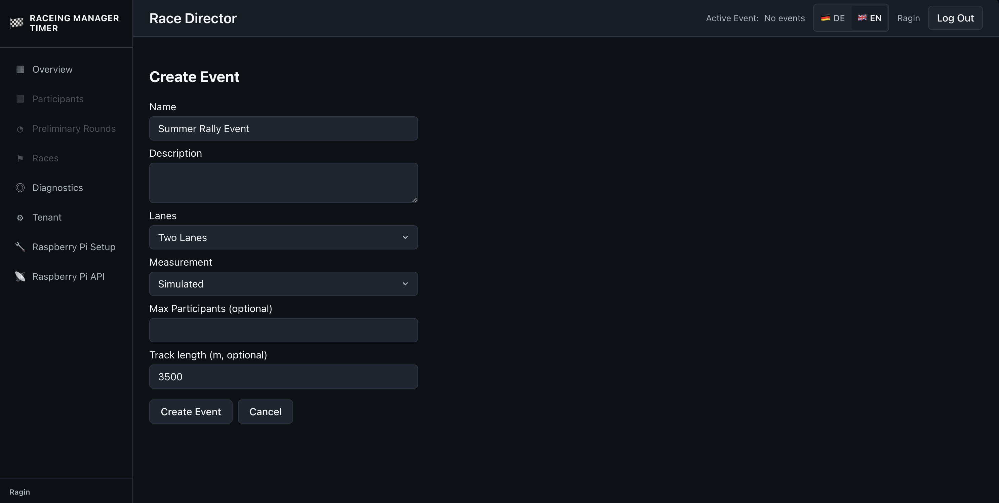

Name, description, lane count, measurement mode (simulated / hardware), optional
max participants and track length.

### 011 — Participants

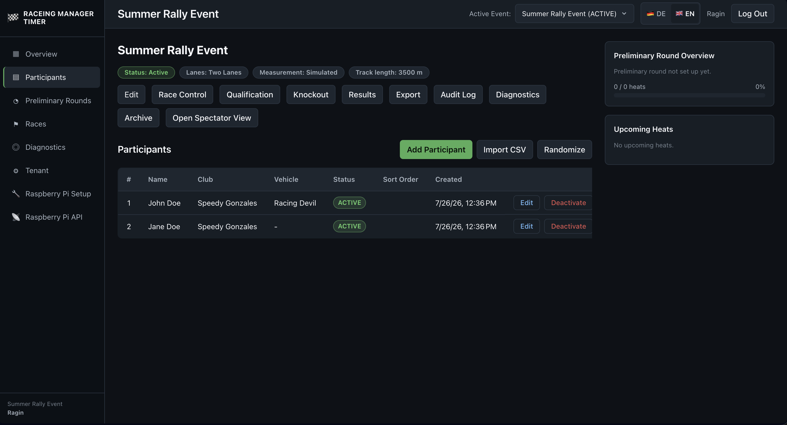

Participant list with club and vehicle, add / CSV import / randomize, plus the
event action bar and the preliminary-round summary.

## Qualification

### 020 — Setup

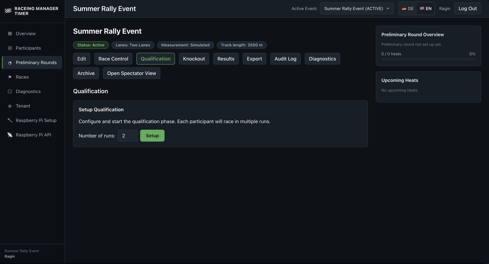

Configure the qualification phase: number of runs per participant.

### 021 — Overview

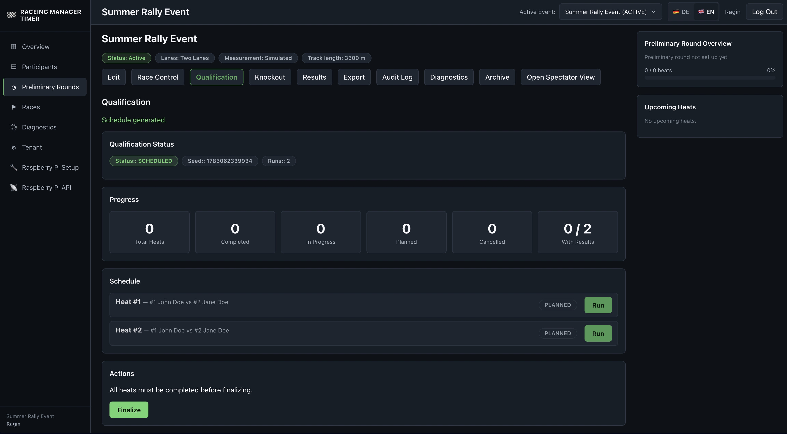

Generated schedule with seed, progress counters and a *Run* button per heat;
*Finalize* locks the phase.

## Race Control

### 030 — Qualification heats

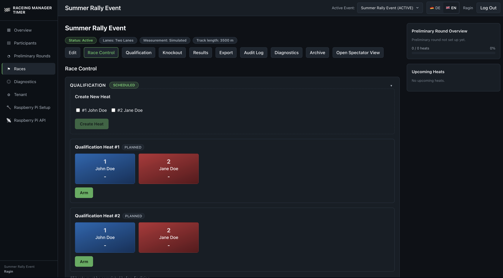

Planned heats with lane assignment, *Arm* per heat, and ad-hoc *Create Heat*.

### 031 — Accept a result

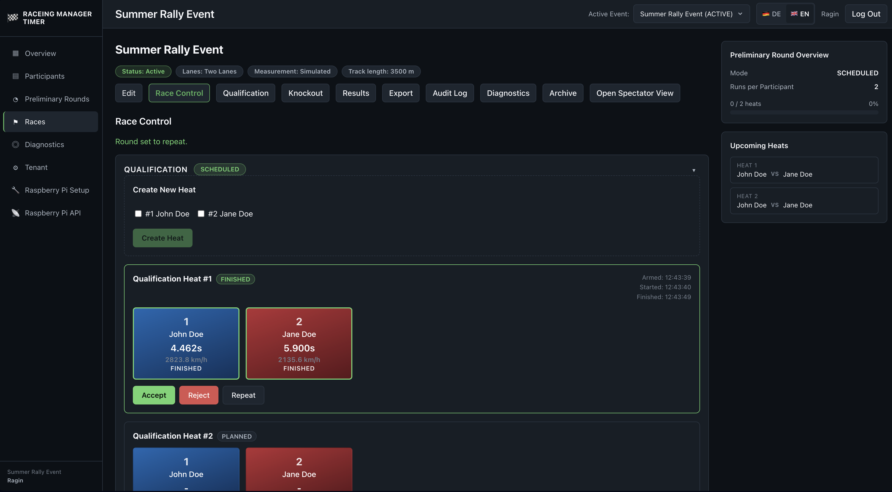

Finished heat with measured times, arm/start/finish timestamps and
*Accept* / *Reject* / *Repeat*.

### 032 — Finalize qualification

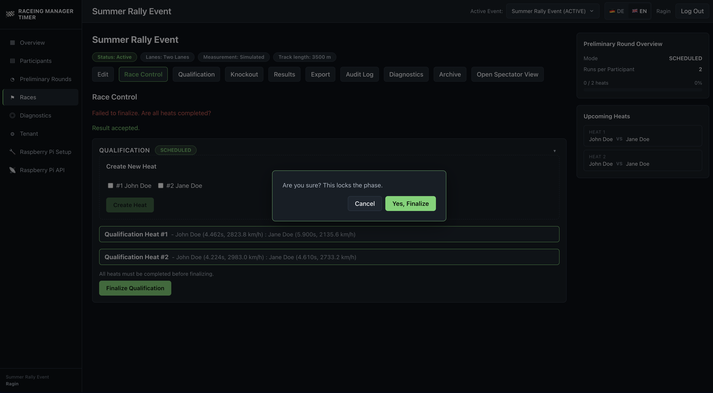

Confirmation dialog before locking the phase; all heats listed with their times.

### 040 — Knockout setup

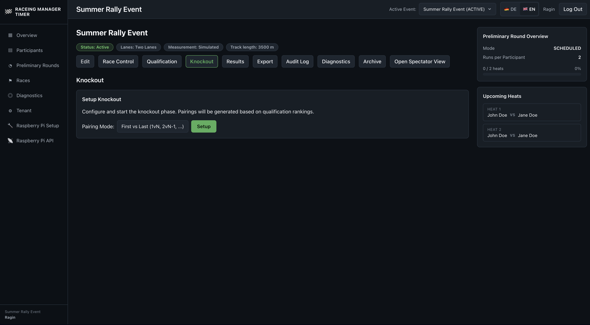

Pairing mode (e.g. first vs. last) for generating the bracket from the
qualification rankings.

## Results

### 050 — Results

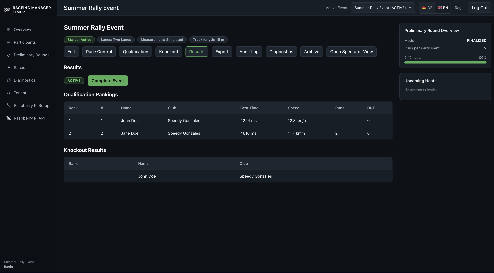

Qualification rankings (best time, speed, runs, DNF) and knockout results;
*Complete Event* closes the event.

## Operations

### 900 — Diagnostics

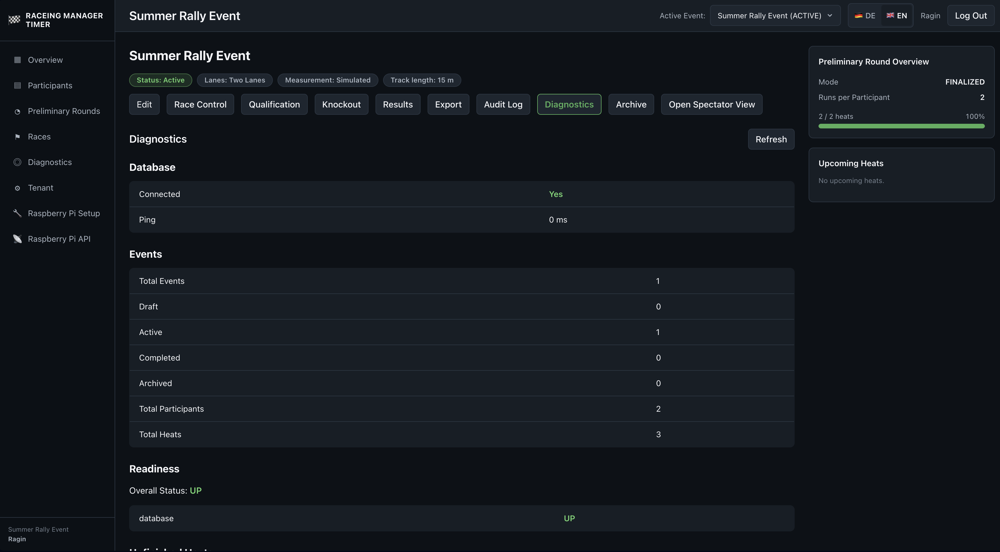

Database connectivity and ping, event/participant/heat counters, readiness status.

### 901 — Arduino setup

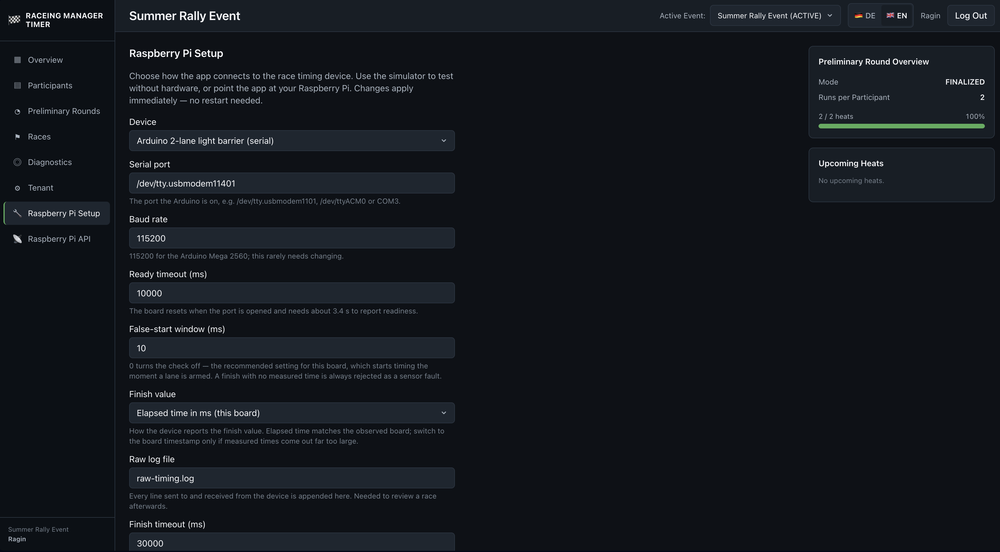

Timing device configuration: serial port, baud rate, timeouts, false-start
window, finish value format, raw log file.
